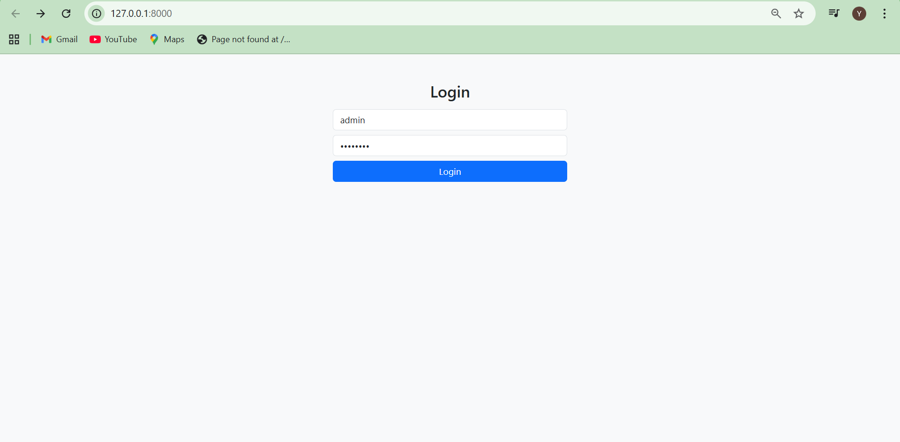
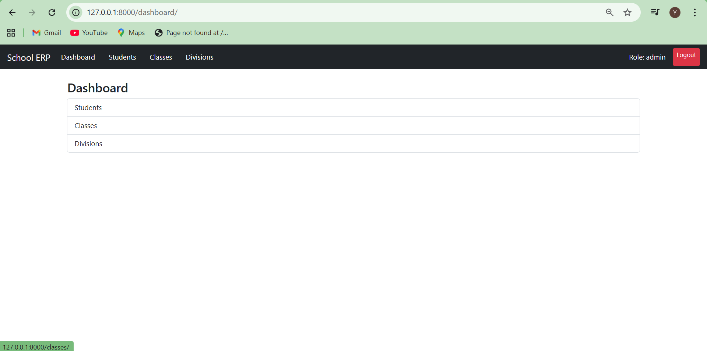
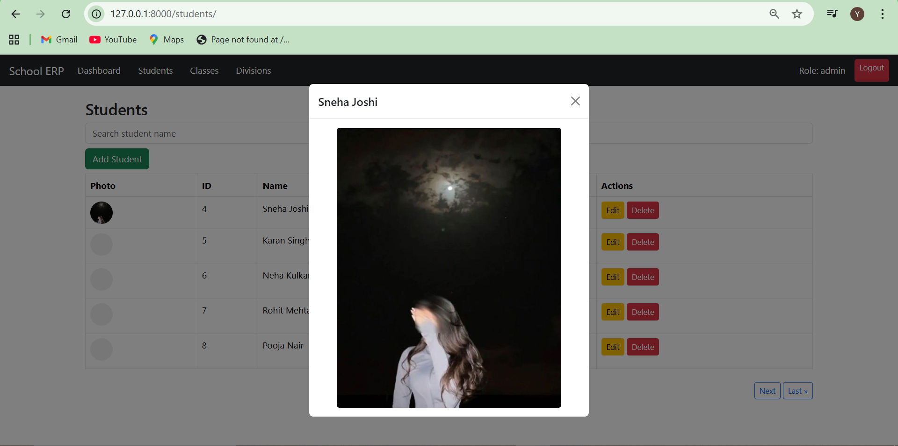

# 🏫 School Management System (ERP)

A comprehensive school management platform built with **Django** to handle student registrations, academic structures, and administrative records. 

## 🌟 Key Features

- **Authentication System:** Secure login/logout for administrative staff.
- **Dashboard Overview:** Centralized navigation to manage Students, Classes, and Divisions.
- **Advanced Student CRUD:**
    - Full Create, Read, Update, and Delete capabilities.
    - **Image Modal Preview:** Clickable profile thumbnails that open full-size photos in a Bootstrap modal.
- **Smart Search & Discovery:** Name-based search functionality to quickly find student records.
- **Pagination:** Clean navigation for large datasets (currently supporting 9+ pages of records).
- **Academic Structure:** Dynamic linking between students, their respective classes, and sections/divisions.

## 🛠️ Tech Stack

- **Backend:** Python 3.14 & Django 4.2
- **Database:** SQLite (Development)
- **Frontend:** Bootstrap 5, HTML5, CSS3
- **Libraries:** Pillow (for image processing)

## 📸 Project Gallery

### 🔐 Administrative Access
| User Login | Dashboard Overview |
| :---: | :---: |
|  |  |

### 👨‍🎓 Student Management
| Student Records List | Dynamic Search Result |
| :---: | :---: |
|  |  |

### 🖼️ Feature Spotlight: Photo Modal
*A smooth Bootstrap modal integration that allows administrators to view student profile pictures in high definition without leaving the page.*



## 🚀 Setup Instructions

1. **Clone the Repo:**
   ```bash
   git clone https://github.com/YuvrajRayate/School-ERP.git
   ```

2. **Go to Project Folder:**
   ```bash
   cd School-ERP
   ```

3. **Create Virtual Environment:**
   ```bash
   python -m venv venv
   ```

4. **Activate Virtual Environment:**

   Windows:
   ```bash
   venv\Scripts\activate
   ```

   macOS/Linux:
   ```bash
   source venv/bin/activate
   ```

5. **Install Requirements:**
   ```bash
   pip install -r requirements.txt
   ```

6. **Apply Migrations:**
   ```bash
   python manage.py migrate
   ```

7. **Create Superuser (Optional):**
   ```bash
   python manage.py createsuperuser
   ```

8. **Run Server:**
   ```bash
   python manage.py runserver
   ```

Then open:
```
http://127.0.0.1:8000/
```
